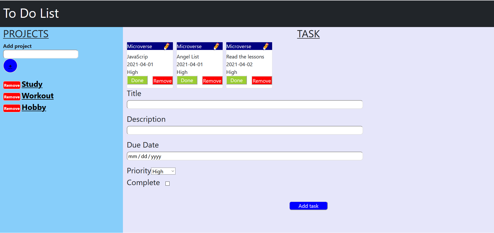

# To-Do-list

## About

This project is a To-Do list web application where users can create projects add tasks to project, delete project and tasks.

## Live demo

[clik here!](https://rawcdn.githack.com/gasb150/to-do-list/e19725ad01f5a75a7ecafa980e4e6b6e18881896/dist/index.html
)

## 🔨 Tested with

Eslint

## Usage

- Open a terminal.
- Clone the repo by typing that command `git clone https://github.com/gasb150/to-do-list`  
- Run `npm run build` in your terminal to run the project locally

## 🔨 Technologies

- HTML5
- CSS3
- Javascript
- VSCode
- Bootstrap
- Linters

## Authors

👤 **Denis Lafontant**

- GitHub: [@icebox827](https://github.com/icebox827)
- Twitter: [@heracles2k5](https://twitter.com/@heracles2k5)
- LinkedIn: [LinkedIn](https://www.linkedin.com/in/denis-lafontant/)

👤 **Gustavo Sanmartin**

- GitHub: [@icebox827](https://github.com/gasb150)
- Twitter: [@heracles2k5](https://twitter.com/7aves)
- LinkedIn: [LinkedIn](https://www.linkedin.com/in/gustavsanmartin/)

## 🤝 Contributing

Contributions, issues, and feature requests are welcome!

Feel free to check the [issues page](https://github.com/gasb150/to-do-list/issues).

## Show your support

Give a ⭐️ if you like this project!

### Acknowledgements

- Microverse
- The Odin Project
- Notion

## 📝 License

This project is [MIT](./LICENSE) licensed.
